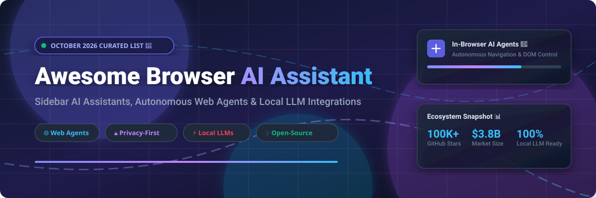

  

  
  
  
  
  

# 🤖 Awesome Browser AI Assistant & Web Agents

> 🌟 **A Curated List of SaaS Platforms & Open-Source Projects for Browser AI Assistants, In-Browser Autonomous Agents, Sidebar Copilots & Local LLM Integrations.**

Welcome to the definitive, SEO-optimized collection of **Browser AI Assistants**, **Sidebar Copilots**, and **Autonomous Web Automation Agents**. Whether you are looking for enterprise-grade SaaS platforms, privacy-first local LLM summarizers, or full DOM-controlling ReAct agents, this repository tracks the best tools in the ecosystem.

---

## 📚 Table of Contents
- [📈 Market Size & Industry Landscape](#-market-size--industry-landscape)
- [💼 SaaS & Hosted Platforms](#-saas--hosted-platforms)
- [🔓 Open-Source GitHub Projects](#-open-source-github-projects)
- [💡 How to Contribute](#-how-to-contribute)
- [⚠️ Disclaimer & Compliance](#-disclaimer--compliance)
- [⭐ Star History](#-star-history)
- [💖 Support & Community](#-support--community)

---

## 📈 Market Size & Industry Landscape

> 📊 **Market Size & Structure**: The global **Browser AI Assistant & Web Agent Market** is estimated at **$3.8 Billion in 2026** (projected to reach **$14.2 Billion by 2030** at a CAGR of 38.5%). The sector is currently **moderately fragmented**. Big tech incumbents (Microsoft, Google, Opera) bundle browser-native assistants to retain user traffic, while specialized SaaS platforms (Monica, Sider, Harpa AI) and open-source frameworks (browser-use, Stagehand, Skyvern) rapidly gain market share by offering multi-model AI flexibility, local LLM privacy options, and autonomous web automation workflows.

---

## 💼 SaaS & Hosted Platforms

> [!NOTE]
> Below is a comparison table of leading SaaS and browser-native AI assistant platforms, sorted by **Company Size / Market Valuation (Descending)**.

| SaaS Product 🚀 | Company Size / Valuation 📊 | Starting Tier Price 💰 | Free Tier Limit / Trial 🎁 | Key Features & Description 💡 |
| :--- | :--- | :--- | :--- | :--- |
| **[Microsoft Copilot in Edge](https://learn.microsoft.com/en-us/training/modules/manage-microsoft-copilot/4-manage-copilot-microsoft-edge)** | **Microsoft** ($3.1 Trillion Market Cap) | **$30.00** / user / month (Copilot Pro/M365) | **Free basic Edge sidebar** (standard web chat & page summaries) | Enterprise DLP protection, deep M365 integration, browsing context awareness, group policy controls. |
| **[Chrome Gemini](https://blog.google/products-and-platforms/products/chrome/chrome-expands-apac/)** | **Google / Alphabet** ($2.2 Trillion Market Cap) | **$19.99** / month (Google One AI Premium) | **Free Chrome Side Panel** (15 requests/min on Gemini 1.5 Flash) | Contextual page summaries, multi-tab comparisons, Gmail/Calendar integration, image transformation. |
| **[Opera Aria](https://blogs.opera.com/tips-and-tricks/2024/10/how-to-get-the-most-from-opera-browsers-native-ai-aria/)** | **Opera Limited** ($1.5 Billion Market Cap) | **$0.00** / month (100% Free native) | **Unlimited text queries** & 30 AI images/day (requires Opera account) | Powered by Composer AI engine, Google Imagen 3 image generation, Page Context mode, text-to-speech. |
| **[Arc Max](https://resources.arc.net/hc/en-us/articles/19335160678679)** | **The Browser Company** ($550 Million Valuation) | **$0.00** / month (Free in Arc) | **100% Free bundled feature** (no query limits) | 5-Second link previews, Tidy Tab Titles, Tidy Downloads, ChatGPT Command Bar, Instant Links. |
| **[Brave Leo](https://support.brave.app/hc/ko/articles/25362740009613)** | **Brave Software** ($100M+ Valuation est.) | **$14.99** / month (Leo Premium) | **Free basic version** (Llama 3 8B & Mixtral, standard rate limits) | Reverse proxy anonymization, zero server log retention, no account required, unlinkable subscription tokens. |
| **[Monica AI](https://chromewebstore.google.com/detail/monica-all-in-one-ai-assi/ofpnmcalabcbjgholdjcjblkibolbppb)** | **Butterfly Effect / Monica** ($50M Valuation est.) | **$9.90** / month (Monica Pro) | **40 free queries/day** (basic) & 5 queries/day (GPT-4o/Claude 3.5) | Multi-chatbot sidebar (GPT-5, Claude 4.5, Gemini 3), Browser Operator multi-site agent, ChatPDF, Deep Research. |
| **[Sider AI](https://sider.ai/)** | **Sider / Summary AI** ($40M Valuation est.) | **$10.00** / month (Sider Pro) | **30 free query credits/day** (resets daily) | Chrome Editor's Choice, Claw autonomous browser agent, live website code editing & persistent DOM modifications. |
| **[Harpa AI](https://chromewebstore.google.com/detail/harpa-ai-web-automation-w/eanggfilgoajaocelnaflolkadkeghjp)** | **Harpa AI** ($15M Valuation est.) | **$15.00** / month (Harpa S1 Pro) | **Free BYOK plan** (Bring Your Own API key / ChatGPT session) | 400k+ users, 100+ browser automation commands, price monitoring, PDF/YouTube summaries, Make/n8n webhooks. |
| **[Merlin AI](https://chromewebstore.google.com/detail/merlin-ai/camppjleccjaphfdbohjdohecfnoikec)** | **Merlin / Foyer** ($12M Valuation est.) | **$19.00** / month (Merlin Pro) | **51 free queries/day** (standard models) | Unified access to GPT-o1, Claude 3.7 Sonnet, DeepSeek, Crafts artifact generator, ChatPDF, cross-platform app. |
| **[HyperWrite](https://chromewebstore.google.com/detail/hyperwrite-ai-writing-ass/kljjoeapehcmaphfcjkmbhkinoaopdnd)** | **OthersideAI** ($10M Valuation est.) | **$19.99** / month (HyperWrite Premium) | **15 free AI generation credits/month** | Real-time predictive text autocomplete for Gmail, Google Docs & web forms via Tab completion. |

---

## 🔓 Open-Source GitHub Projects

> [!TIP]
> Open-source browser agents offer full transparency, custom automation workflows, local LLM support (Ollama/LM Studio), and privacy-first browsing.
> The projects below are sorted by **GitHub Star Count (Descending)**.

1. 🤖 **[browser-use](https://github.com/browser-use/browser-use)** 
   - **Description**: The premier open-source web automation library for AI agents. Makes websites accessible for LLMs with full Playwright DOM control, multi-tab execution, and vision support.
   - **Key Tech**: Python, Playwright, LangChain/LlamaIndex support, Cloud & Local LLM support.

2. 🎭 **[Stagehand](https://github.com/browserbase/stagehand)** 
   - **Description**: An AI browser automation framework built on Playwright. Uses natural language primitives (`act`, `extract`, `observe`) for resilient web interaction.
   - **Key Tech**: TypeScript, Playwright, Browserbase infra.

3. 🚁 **[Skyvern](https://github.com/Skyvern-AI/skyvern)** 
   - **Description**: Automates browser-based workflows using LLMs and Computer Vision. Replaces fragile Playwright scripts with resilient AI-driven element discovery.
   - **Key Tech**: Python, Computer Vision, Playwright, LLM Orchestration.

4. 🌊 **[LaVague](https://github.com/lavague-ai/LaVague)** 
   - **Description**: Large Action Model (LAM) framework for browser automation. Converts natural language instructions into executable Selenium / Playwright code.
   - **Key Tech**: Python, Selenium, Text-to-WebAction pipeline.

5. 🦅 **[Oryonix AI](https://github.com/Subhankar-Patra1/Oryonix-ai)** 
   - **Description**: Fully open-source autonomous browser co-pilot extension with local LLM integration via Ollama and multi-tab lifecycle control.
   - **Key Tech**: Browser Extension, Firefox/Chrome support, Ollama localhost, RemotePageController.

6. 🎯 **[Blackreach](https://github.com/Null-Phnix/blackreach)** 
   - **Description**: CLI-based autonomous research & browser agent using the ReAct loop (Observe → Think → Act) and DOM Walker element numbering.
   - **Key Tech**: Python, Playwright, ReAct Pattern, Session Resume, Stuck Detection.

7. 📝 **[AI Summary Helper](https://github.com/philffm/ai-summary-helper)** 
   - **Description**: Open-source Chrome extension for page summarization with BYOK (Bring Your Own Key) or 100% local Ollama, Kindle export & reading knowledge graph.
   - **Key Tech**: JavaScript, Side Panel API, Local Ollama, Graph Visualization.

---

## 💡 How to Contribute

We welcome community contributions! Please follow these simple steps:

1. 🍴 **Fork** this repository.
2. 📝 **Add/Update** your entry in `README.md` following the tabular or open-source list format.
3. 📌 **Include**: Name, official link, pricing details, star badge (for open source), and factual description.
4. 🚀 **Submit a Pull Request** with a brief summary of additions.

Refer to [Awesome-Awesome-Awesome](https://github.com/ishandutta2007/Awesome-Awesome-Awesome) for generic awesome list guidelines.

---

## ⚠️ Disclaimer & Compliance

- This list is **community-curated** for research and evaluation purposes.
- Browser AI assistants access active webpage content, DOM trees, and browsing session data. Always verify organizational data loss prevention (DLP) and privacy compliance before deploying extensions.
- Open-source browser agents require appropriate API rate limits or local GPU resources (e.g. via Ollama) when running vision-based models.

---

## ⭐ Star History

---

## 💖 Support & Community

Thank you for exploring **Awesome-Browser-AI-Assistant**! If this repository helped you discover great AI tools or build browser agents, please consider supporting the project:

- ⭐ **Star this repository** to boost its visibility on GitHub!
- 🔀 **Fork & Share** with developers, researchers, and AI enthusiasts.
- ☕ **Sponsor the Maintainer**:

  

---

  Maintained with ❤️ by <a href="https://github.com/ishandutta2007">Ishan Dutta</a> and the Open-Source Community.

